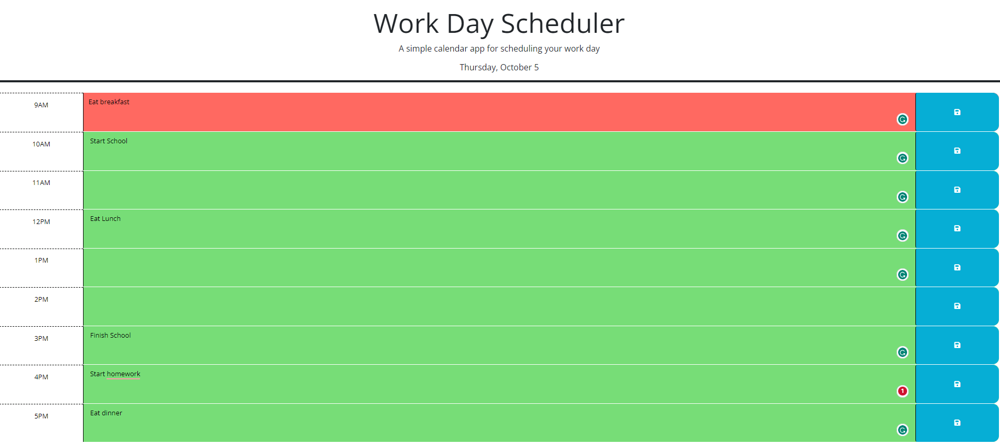

# Work Day Scheduler

## Description

This is a very simple daily calender web app where one can log their TODOs for the day and have them saved. The data is saved to local storage and loaded in their respective time blocks on page load. 

## Installation

N/A

## Usage

To use this daily calender simply make an entry to the time block you choose to record to and click the save button. Your entry will be saved and will be displayed on the page next time the page loads.  
View and use my deployed page at => https://jradmorrison.github.io/work-day-scheduler/

## License

Please refer to the license in teh root folder.
